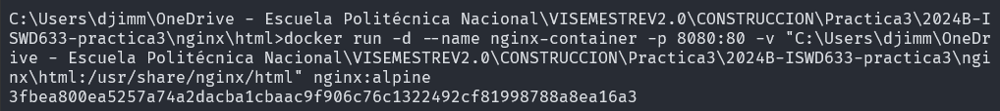

# VOLUMEN TIPO HOST
Un volumen host (o bind mount) es un tipo de volumen donde se monta un directorio o archivo específico del sistema de archivos del host en un contenedor.

```
docker run -d --name <nombre contenedor> -v <ruta carpeta host>:<ruta carpeta contenedor> <imagen> 
```
### En tu computador crear una carpeta llamada nginx y dentro de esta carpeta crea otra llamada html. Como se aprecia en la figura.


### Crear un volumen tipo host con la imagen nginx:alpine, mapear todos por puertos, para la ruta carpeta host colocar el directorio en donde se encuentra la carpeta html en tu computador y para la ruta carpeta contenedor: /usr/share/nginx/html (esta ruta se obtiene al revisar la documentación de la imagen)


### ¿Qué sucede al ingresar al servidor de nginx?
Al ingresar al servidor de Nginx en http://localhost, se muestran los archivos HTML o recursos estáticos (como imágenes, CSS, JavaScript) que estén en la carpeta local C:\Users\SoloParaKerlly\Desktop\nginx. Si existe un archivo index.html, Nginx lo servirá automáticamente como la página principal.
### ¿Qué pasa con el archivo index.html del contenedor?
El archivo index.html predeterminado del contenedor de nginx será reemplazado por el contenido que tengas en la carpeta html de tu sistema host. Si no hay un index.html en la carpeta html, nginx mostrará su página por defecto o un mensaje de error de "403 Forbidden".

### Ir a https://html5up.net/ y descargar un template gratuito, descomprirlo dentro de tu computador en la carpeta html


### ¿Qué sucede al ingresar al servidor de nginx?
Cuando ingresas al servidor, nginx cargará y mostrará el contenido del template que descargaste. Esto se debe a que nginx servirá los archivos que estén en /usr/share/nginx/html, y con el volumen tipo host, esta ruta está mapeada a la carpeta html de tu host.

### Eliminar el contenedor

### ¿Qué sucede al crear nuevamente el mismo contenedor con volumen de tipo host a los directorios definidos anteriormente?
Cuando vuelvas a crear el contenedor usando la misma configuración, nginx servirá el contenido de la carpeta html del host, ya que el volumen sigue apuntando a esa ruta. El contenido del template seguirá apareciendo en el servidor de nginx.

### ¿Qué hace el comando pwd?
El comando pwd (print working directory) imprime la ruta completa del directorio actual en el que te encuentras. Por ejemplo, si estás en la carpeta nginx, el comando pwd mostrará la ruta de esa carpeta.

Si quieres incluir el comando pwd dentro de un comando de Docker, lo puedes hacer de diferentes maneras dependiendo del shell que estés utilizando.


### Volumen tipo host usando PWD y PowerShell
```
docker run -d --name <nombre contenedor> --publish published=<valorPuertoHost>,target=<valor> -v ${PWD}/<ruta relativa>:<ruta absoluta> <nombre imagen>:<tag> 
```

### Volumen tipo host usando PWD (Git Bash)

```
docker run -d --name <nombre contenedor> --publish published=<valorPuertoHost>,target=<valor> -v $(pwd -W)/html:/usr/share/nginx/html <nombre imagen>:<tag> 
```

### Volumen tipo host usando PWD (en Linux)

```
docker run -d --name <nombre contenedor> --publish published=<valorPuertoHost>,target=<valor> -v $(pwd)/html:/usr/share/nginx/html <nombre imagen>:<tag> 
```

