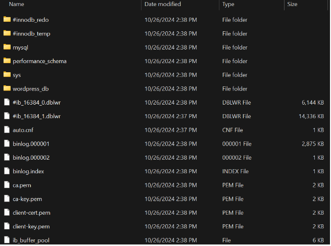

## Esquema para el ejercicio

### Crear red net-wp

### Para que persista la información es necesario conocer en dónde mysql almacena la información.
# COMPLETAR LA SIGUIENTE ORACIÓN. REVISAR LA DOCUMENTACIÓN DE LA IMAGEN EN https://hub.docker.com/
En el esquema del ejercicio carpeta del contenedor (a) es (COMPLETAR CON LA RUTA)

Ruta carpeta host: .../ejercicio3/db

### ¿Qué contiene la carpeta db del host?
La carpeta db del host contiene todos los archivos y directorios que representan la base de datos de MySQL, como archivos de datos, logs y configuraciones.

### Crear un contenedor con la imagen mysql:8  en la red net-wp, configurar las variables de entorno: MYSQL_ROOT_PASSWORD, MYSQL_DATABASE, MYSQL_USER y MYSQL_PASSWORD

### ¿Qué observa en la carpeta db que se encontraba inicialmente vacía?
En la carpeta db ahora se encuentran archivos y carpetas creados por MySQL para almacenar las bases de datos, tablas y configuraciones, lo que garantiza la persistencia de datos.

### Para que persista la información es necesario conocer en dónde wordpress almacena la información.
# COMPLETAR LA SIGUIENTE ORACIÓN. REVISAR LA DOCUMENTACIÓN DE LA IMAGEN EN https://hub.docker.com/
En el esquema del ejercicio la carpeta del contenedor (b) es (COMPLETAR CON LA RUTA)

Ruta carpeta host: .../ejercicio3/www

### Crear un contenedor con la imagen wordpress en la red net-wp, configurar las variables de entorno WORDPRESS_DB_HOST, WORDPRESS_DB_USER, WORDPRESS_DB_PASSWORD y WORDPRESS_DB_NAME (los valores de estas variables corresponden a los del contenedor creado previamente)

### Personalizar la apariencia de wordpress y agregar una entrada

### Eliminar el contenedor y crearlo nuevamente, ¿qué ha sucedido?

Cuando eliminas y creas nuevamente el contenedor de WordPress, los datos y las personalizaciones permanecen intactos, ya que están guardados en la carpeta del host (www) y en la base de datos MySQL (db). Esto demuestra que la información persiste gracias al uso de volúmenes.

